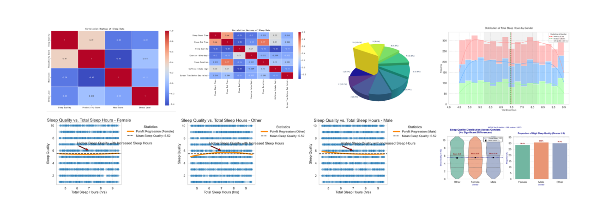

# DataMining_HW1

Welcome to our Data Mining Group Work repository for Homework 1! This project focuses on analyzing sleep-related metrics across different gender groups, aiming to uncover patterns and relationships that can provide actionable insights into sleep behavior.

## Introduction

This report analyzes a comprehensive dataset of 5000 individuals, focusing on the distribution and relationships of sleep-related metrics, particularly "Sleep Quality" and "Total Sleep Hours", across different gender groups. The analysis employs a combination of advanced visualizations and statistical techniques to uncover patterns and differences. Key visualizations include stacked histograms with overlaid kernel density estimation (KDE) for sleep duration distributions, 3D pie charts for sleep quality categories, and heatmaps to explore correlations between sleep quality and other variables such as productivity, mood, and stress levels. Statistical measures such as ANOVA, skewness, kurtosis, and correlation coefficients are used to enhance the understanding of variability, distribution shape, and relationships within the data. The goal is to identify significant patterns and differences across gender groups, providing actionable insights into how sleep quality and duration vary and interact with other factors, ultimately contributing to a deeper understanding of sleep behavior and its implications.

## Visualization

Below is a visualization showcasing the distribution of sleep quality across different gender groups:



*Figure 1: Distribution of Sleep Quality by Gender*

## Repository Structure

- **/data**: Contains the dataset used for the analysis.
- **/notebooks**: Jupyter notebooks with the code for data analysis and visualization.
- **/results**: Output files, including visualizations and statistical results.
- **README.md**: This file, providing an overview of the project.

## Getting Started

To get started with this project, clone the repository and install the necessary dependencies.

```bash
git clone https://github.com/your-username/DataMining_HW1.git
cd DataMining_HW1
pip install -r requirements.txt
